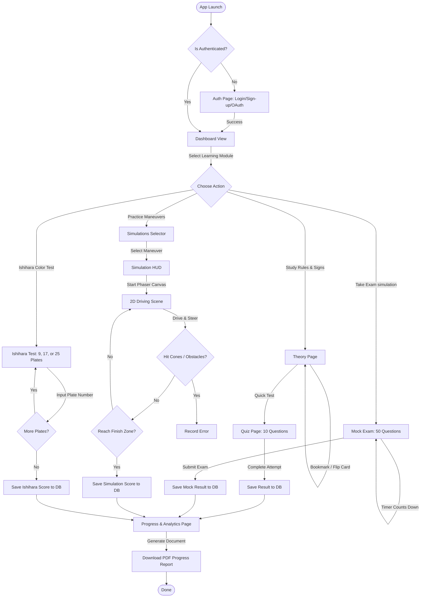
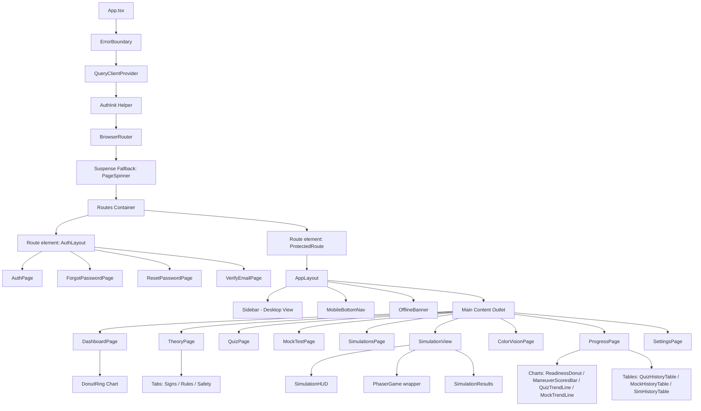

# Technical Architecture & Audit Report

## 1. Executive Summary
DriveMy is a Progressive Web Application (PWA) designed to serve as a bilingual (English and Bahasa Malaysia) study and preparation companion for Malaysian learner drivers preparing for the JPJ KPP1 theory exam and practical driving test. The application is architected as a Single Page Application (SPA) built on a modern frontend stack using **React 19**, **Vite 8** (with SWC compiler), and **TypeScript**, styled via **Tailwind CSS**. It incorporates the **Phaser 3** game engine to execute real-time, interactive 2D practical driving test simulations. The application utilizes a Serverless Backend-as-a-Service (BaaS) paradigm powered by **Supabase** for user authentication, PostgreSQL database storage, and secure media retrieval. It features an offline-first transactional queue backed by **IndexedDB** (`idb-keyval`) to cache test submissions offline and synchronize them when network connectivity is re-established. Project dependencies are managed using the npm package manager.

---

## 2. Project Structure

### Directory Mapping
The directory tree below maps out the `src/` directory and other critical configuration folders, explaining the core responsibilities of each module:

*   **`supabase/`** - Contains configuration and relational schema setup files for the serverless database.
    *   `config.toml` - Global configuration settings for local Supabase environments.
    *   `setup_schema.sql` - Complete database schema, including tables (`kpp_questions`, `quiz_results`, `mock_test_results`, `simulation_results`, `theory_progress`, `colorblind_results`), indexes, Row Level Security (RLS) policies, and database permissions.
*   **`src/`** - Root folder for the React application source code.
    *   **`assets/`** - Contains static assets such as SVG vector assets and real-world road sign images used in the KPP1 theory guide.
        *   `signs/svg/` - SVG-rendered regulatory and prohibitory road signs.
        *   `signs/real/` - Real-world warning and informational road signs.
    *   **`components/`** - Reusable UI elements and feature-specific components.
        *   `exam/` - Components managing KPP1 mock test timers, overlays, and question cards.
        *   `progress/` - Visualization components such as `ReadinessDonut.tsx` and custom progress tables.
        *   `safety/` - Warning and informational UI cards for road safety guides.
        *   `shared/` - Layout and utility wrappers.
            *   `AppLayout.tsx` - Responsive shell (Sidebar for desktop, Bottom Navigation for mobile).
            *   `AuthLayout.tsx` - Layout shell for authentication views.
            *   `ProtectedRoute.tsx` - Middleware component guarding dashboard/progress behind auth gates.
            *   `OfflineBanner.tsx` - Visual warning displayed when browser connectivity is lost.
            *   `LanguageToggle.tsx` - Interactive language selection pill/toggle.
        *   `simulation/` - HUD and result cards for Phaser-based driving simulations.
        *   `theory/` - Flip cards and visual aids for learning road rules.
        *   `ui/` - Atomic Radix-UI primitive elements (accordion, avatar, checkbox, dialog, select, etc.).
    *   **`games/`** - Core Phaser game setup for 2D driving simulation.
        *   `PhaserGame.tsx` - React wrapper establishing the Phaser canvas context.
        *   `scenes/` - Individual Phaser scenes executing driving maneuvers:
            *   `DrivingScene.ts` - Main base scene controlling 2D bicycle-model car physics, keyboard/touch controls, and collision detection.
            *   `HillStartScene.ts` - Side-view manual hill start test.
            *   `ParallelParkingScene.ts` - Top-down parallel parking maneuver.
            *   `RampTestScene.ts` - Side-view ramp control test.
            *   `RoadMergingScene.ts` - Top-down highway merge with moving obstacle cars.
            *   `SCurveScene.ts` - Navigating spline-based S-curve pathways.
            *   `SideParkingScene.ts` - Top-down side parking maneuver.
            *   `ThreePointTurnScene.ts` - Three-step vehicle turn-around boundaries.
            *   `ZCurveScene.ts` - Right-angle Z-curve boundary navigation.
    *   **`hooks/`** - Custom React hooks for business logic and data queries.
        *   `useAuth.ts` - Bridging auth state requests.
        *   `useOfflineSync.ts` - Offline synchronization manager flushing IndexedDB data to Supabase.
        *   `useProgressStats.ts` - Hooks calculating user study statistics and readiness scores.
        *   `useQuestions.ts` - Fetching KPP1 questions by categories and sets.
        *   `useResults.ts` - Submitting scores for quizzes, mocks, simulations, and colorblind tests.
    *   **`lib/`** - Shared helper utilities and static constants.
        *   `constants.ts` - Application routes, storage keys, and exam parameters (e.g., pass mark).
        *   `offlineStorage.ts` - IndexedDB-backed transactional write queue using `idb-keyval`.
        *   `generatePDF.ts` / `generateProgressPDF.ts` - Logic for rendering downloadable PDF progress reports.
        *   `supabase.ts` - Initialized Supabase client instance.
        *   `translations/` - Translation dictionary files for EN/BM support.
    *   **`pages/`** - View layouts bound to individual React routes.
        *   `auth/` - Auth pages (Sign-in/up, Forgot Password, Reset Password, Email Verification).
        *   `ColorVisionPage.tsx` - Multi-tier Ishihara color vision deficiency test.
        *   `DashboardPage.tsx` - Student dashboard with readiness indicators and recent activities.
        *   `MockTestPage.tsx` - Main 50-question KPP1 mock exam engine.
        *   `ProgressPage.tsx` - Analytics panel displaying Recharts charts and attempt histories.
        *   `QuizPage.tsx` - Modular 10-question category practice exams.
        *   `SimulationView.tsx` - Wrapper executing and providing HUD controls to the active Phaser simulation.
        *   `SimulationsPage.tsx` - Selection page listing the 8 JPJ practical driving maneuvers.
        *   `TheoryPage.tsx` - Educational hub for road signs, traffic rules, and safety principles.
    *   **`stores/`** - Lightweight client state containers.
        *   `authStore.ts` - Manages authenticated user session and developer bypass switches.
        *   `languageStore.ts` - Manages active language locale (EN/BM) and translations.
        *   `quizStore.ts` - Persists state of active quiz sessions (answers, time remaining) to survive page refreshes.
        *   `themeStore.ts` - Manages active appearance theme (light, dark, or system).
        *   `uiStore.ts` - Controls structural sidebar state toggles.
    *   **`types/`** - TypeScript interface definitions.
        *   `database.ts` - Auto-generated types mapping to database tables.
        *   `quiz.ts` - Structures for KPP1 questions, quiz sessions, and answers.
        *   `user.ts` - Structures for driver profile properties.
    *   `App.tsx` - Root component containing TanStack Query Client, React Router routes, and global contexts.
    *   `main.tsx` - Bootstraps the application and registers the PWA service worker.
    *   `index.css` - Custom baseline CSS rules, animations, and Tailwind design variables.

### Architecture Summary
*   **Frontend Framework**: React 19.2.6
*   **Build Tool**: Vite 8.0.12 (utilizing `@vitejs/plugin-react-swc` for fast compiler transforms)
*   **PWA Integrator**: `vite-plugin-pwa` generating custom Service Workers with standard caching policies for Google Fonts, local images, and Supabase endpoints.
*   **Client State Strategy**: Zustand 5.0.5 for structural UI, active language localizations, appearance themes, and active quiz session persistence.
*   **Server State Strategy**: TanStack React Query 5.80.7 for fetching, caching, and invalidating database data.
*   **Backend Paradigm**: Serverless BaaS powered by Supabase (auth services and database client interfaces).
*   **Database**: PostgreSQL hosted on Supabase (configured using RLS policies).
*   **Auth Provider**: Supabase Auth (with support for native Email/Password credentials and Google OAuth).

---

## 3. Application Flowcharts

### System Architecture & Data Flow
The diagram below details the data flow between user inputs, client storage systems, custom hooks, and external database systems:

```mermaid
graph TD
  User([User Interface]) -->|User Actions / Inputs| ReactApp[React 19 Frontend Components]
  ReactApp -->|Read Preferences / UI State| ZustandStores[Zustand Stores]
  ReactApp -->|Mutations & Queries| ReactQuery[TanStack React Query]
  ReactQuery -->|Network Check: Online| SupabaseSDK[@supabase/supabase-js Client]
  ReactQuery -->|Network Check: Offline| IndexedDBQueue[(IndexedDB Write Queue)]
  
  subgraph Client Storage
    ZustandStores -->|Persist Session/Theme| LocalStorage[(Local Storage)]
    IndexedDBQueue -->|idb-keyval Storage| IDB[(Browser IndexedDB)]
  end
  
  subgraph External Cloud Infrastructure (Supabase)
    SupabaseSDK -->|Secure API Requests| SupabaseAPI[Supabase Gateway]
    SupabaseAPI -->|Auth Verification| SupabaseAuth[Supabase Auth Service]
    SupabaseAPI -->|SQL Queries under RLS| PostgreSQL[(PostgreSQL Database)]
    SupabaseAuth -->|OAuth Redirects| GoogleOAuth[Google IDP]
  end

  IndexedDBQueue -.->|useOfflineSync Flushes on 'online' event| SupabaseSDK
```

### User Journey Flow
The workflow below illustrates the step-by-step user path from entry up to obtaining readiness statistics:



### Frontend Component Hierarchy
The React tree below highlights the nesting of layout templates, route guards, pages, and key interactive components:



---

## 4. Technology & Dependency Inventory

The table below lists all direct and development dependencies declared in the project's configurations:

| Dependency | Version | Purpose / Notes | Direct/Transitive |
| :--- | :--- | :--- | :--- |
| **Core Frameworks & Runtimes** | | | |
| `react` | `^19.2.6` | Core UI render engine | Direct |
| `react-dom` | `^19.2.6` | Web DOM adapter for React UI rendering | Direct |
| `react-router-dom` | `^6.30.1` | Declarative routing engine for Single Page Application | Direct |
| `tslib` | `^2.8.1` | Shared helper runtime library for TypeScript | Direct |
| `typescript` | `~6.0.2` | Static type checker compiler for TypeScript source files | Dev |
| `@types/node` | `^24.12.3` | Type definitions for Node.js environments | Dev |
| `@types/react` | `^19.2.14` | Type definitions for React components | Dev |
| `@types/react-dom` | `^19.2.3` | Type definitions for React DOM interactions | Dev |
| **State Management & Data Fetching** | | | |
| `zustand` | `^5.0.5` | Lightweight client state store | Direct |
| `@tanstack/react-query` | `^5.80.7` | Async data fetching, server-state cache management, and mutation hooks | Direct |
| `idb-keyval` | `^6.2.4` | IndexedDB key-value wrapper used to implement the offline transaction queue | Direct |
| **Backend / Server & APIs** | | | |
| `@supabase/supabase-js` | `^2.50.0` | Client library for Supabase DB queries, storage, and authentication services | Direct |
| **UI / Styling** | | | |
| `tailwindcss` | `^3.4.17` | Utility-first CSS styling framework | Dev |
| `autoprefixer` | `^10.4.21` | PostCSS plugin parsing CSS to add vendor prefixes | Dev |
| `postcss` | `^8.5.6` | Tool for transforming CSS styles with JS plugins | Dev |
| `class-variance-authority` | `^0.7.1` | Utility to build type-safe UI variants for CSS classes | Direct |
| `clsx` | `^2.1.1` | Utility to construct className strings conditionally | Direct |
| `tailwind-merge` | `^3.3.0` | Utility to merge Tailwind CSS classes avoiding style conflicts | Direct |
| `tailwindcss-animate` | `^1.0.7` | Animation utilities plugin for Tailwind CSS | Dev |
| `@radix-ui/react-accordion` | `^1.2.11` | Unstyled accessible Accordion UI primitive | Direct |
| `@radix-ui/react-avatar` | `^1.1.10` | Unstyled accessible Avatar UI primitive | Direct |
| `@radix-ui/react-checkbox` | `^1.3.3` | Unstyled accessible Checkbox UI primitive | Direct |
| `@radix-ui/react-dialog` | `^1.1.14` | Unstyled accessible Modal Dialog UI primitive | Direct |
| `@radix-ui/react-dropdown-menu` | `^2.1.15` | Unstyled accessible Dropdown UI primitive | Direct |
| `@radix-ui/react-label` | `^2.1.7` | Unstyled accessible Form Label UI primitive | Direct |
| `@radix-ui/react-progress` | `^1.1.7` | Unstyled accessible Progress Bar UI primitive | Direct |
| `@radix-ui/react-radio-group` | `^1.3.8` | Unstyled accessible Radio Button Group UI primitive | Direct |
| `@radix-ui/react-select` | `^2.2.5` | Unstyled accessible Dropdown Select UI primitive | Direct |
| `@radix-ui/react-separator` | `^1.1.7` | Unstyled accessible Visual Separator UI primitive | Direct |
| `@radix-ui/react-slider` | `^1.3.6` | Unstyled accessible Input Range Slider UI primitive | Direct |
| `@radix-ui/react-slot` | `^1.2.4` | Composable utility to merge element properties to children | Direct |
| `@radix-ui/react-switch` | `^1.2.5` | Unstyled accessible Toggle Switch UI primitive | Direct |
| `@radix-ui/react-tabs` | `^1.1.12` | Unstyled accessible Tabs Container UI primitive | Direct |
| `@radix-ui/react-toast` | `^1.2.14` | Unstyled accessible Toast alert notifications primitive | Direct |
| `@radix-ui/react-tooltip` | `^1.2.7` | Unstyled accessible Tooltip helper UI primitive | Direct |
| `lucide-react` | `^0.511.0` | Accessible vector icon library | Direct |
| `phosphor-react` | `^1.4.1` | Flexible vector icon library used across main layouts | Direct |
| `motion` | `^12.40.0` | Declarative UI animation engine | Direct |
| `sonner` | `^2.0.5` | Smooth Toast notifications component | Direct |
| **Specialized Libraries** | | | |
| `phaser` | `^3.90.0` | 2D Game Engine running simulated driving maneuvers | Direct |
| `recharts` | `^3.0.0` | SVG-based dashboard chart rendering library | Direct |
| `canvas-confetti` | `^1.9.4` | Confetti animation library used for passing visual rewards | Direct |
| `@types/canvas-confetti` | `^1.9.0` | Type definitions for canvas-confetti interactions | Dev |
| `date-fns` | `^4.1.0` | JavaScript date utility library | Direct |
| `html2canvas` | `^1.4.1` | HTML-to-Canvas screenshot rendering tool for reports | Direct |
| `jspdf` | `^4.0.0` | Direct client-side PDF document generation tool | Direct |
| `jspdf-autotable` | `^5.0.2` | Auto-table formatting plugin for jsPDF reports | Direct |
| `workbox-window` | `^7.3.0` | Progressive Web App offline asset routing and registration lifecycle | Direct |
| **Testing & Quality** | | | |
| `eslint` | `^10.3.0` | Linter verifying source code styling rules | Dev |
| `@eslint/js` | `^10.0.1` | Default javascript rule configurations for ESLint | Dev |
| `eslint-plugin-react-hooks` | `^7.1.1` | Linter plugin validating React hooks rendering cycles | Dev |
| `eslint-plugin-react-refresh` | `^0.5.2` | Linter plugin enforcing Hot Module Reload requirements | Dev |
| `typescript-eslint` | `^8.59.2` | Type-aware ESLint bindings for TypeScript | Dev |
| `globals` | `^17.6.0` | Predefined global variables configuration map for ESLint | Dev |
| `puppeteer` | `^25.1.0` | Headless browser automation library used for verification tasks | Dev |
| `tsx` | `^4.22.3` | CLI utility to run TypeScript files directly in node environments | Dev |
| `vite` | `^8.0.12` | Local dev server and assets bundler config | Dev |
| `@vitejs/plugin-react-swc` | `^4.3.1` | SWC plugin compiler integration for Vite | Dev |
| `vite-plugin-pwa` | `^1.0.0` | Zero-config PWA compiler integration for Vite | Dev |
| *Transitive Dependencies* | *N/A* | Not detected in package.json (transitive dependencies are managed by package manager) | Transitive |

---

## 5. Detailed Architectural Breakdown

### A. Data Flow and State Strategy
1.  **Server State (TanStack Query)**: Dynamic content from Supabase (e.g., theory progress, quiz high scores, mock test results, driving simulations) is managed on the client side using React Query. Queries (defined in `useQuestions.ts` and `useProgressStats.ts`) maintain caching parameters (`staleTime` of 5 minutes, query keys such as `['questions', 'set', setId]`) to avoid redundant API network requests.
2.  **Global Client State (Zustand)**: Ephemeral preferences, authentication sessions, translations, and theme statuses are kept in memory using Zustand stores. 
    *   `authStore` stores the current User metadata and exposes flags like `isDevBypass` (allowing developer offline bypass gates).
    *   `quizStore` persists user progress mid-exam to standard browser storage (`drivemy-quiz-progress`). This prevents data loss if a user accidentally reloads their page during a 45-minute mock test.
3.  **Local Component State**: Standard React `useState` hooks manage transient inputs (e.g., active input string on the Ishihara plate view, search strings on the theory page, or mobile menu expand states).
4.  **Offline-First Syncing (IndexedDB & PWA Service Worker)**:
    *   Assets (HTML/JS/CSS bundles, local SVGs, real-world signs, and Google Fonts) are cached on local storage via the workbox service worker.
    *   The `useOfflineSync.ts` hook monitors browser connection changes. If the user completes tests offline, results are saved locally using IndexedDB (`idb-keyval` stores inside the `'offline-write-queue'` key). Once the browser triggers the `online` window event, the queue flushes the cached attempts to the Supabase database.

### B. Authentication & Security
1.  **Authentication Gate**: `App.tsx` routes are partitioned. Public routes (`/auth`, `/forgot-password`, `/reset-password`, `/verify-email`) sit inside `AuthLayout.tsx`. Protected pages (Dashboard, Simulations, Profile, Progress) are wrapped inside the `ProtectedRoute.tsx` container.
2.  **Authorization Mechanism**: `ProtectedRoute.tsx` validates if the active user session is present in `authStore`. If missing, the component redirects the request to `/auth` while saving the aborted location context in `location.state.from` to permit redirection after login.
3.  **Supabase RLS Rules**: At the database level, security is enforced using PostgreSQL Row Level Security (RLS) rules defined in `setup_schema.sql`:
    *   `kpp_questions`: Readable by any authenticated user (`USING (true)`).
    *   `quiz_results`, `mock_test_results`, `simulation_results`, `theory_progress`, `colorblind_results`: Restricted strictly to owners via `auth.uid() = user_id`. This prevents cross-tenant access to user statistics.

### C. Key Modules & Responsibilities
*   **Authentication**: Implemented using `auth.service.ts` interfacing with Supabase auth. Support includes basic authentication sign-ups/logins, password-reset emails pointing to `/reset-password`, and redirect callbacks (`/auth/callback`) routing users after Google OAuth challenges.
*   **Theory Learning**: Located in `TheoryPage.tsx`. Features interactive categories (Regulatory, Warning, Informational) displaying flip cards. Selecting a card triggers an animation, swapping the sign vector image for an explanation of the sign's legal meaning.
*   **Exam Engine**: Found in `MockTestPage.tsx` and `QuizPage.tsx`. Pulls random questions from the `kpp_questions` table. Standard mock tests pull exactly 50 questions across KPP1 categories (Signs, Rules, General Knowledge) under a 45-minute limit. Answers are recorded in `quizStore` and evaluated upon submission.
*   **Driving Simulator**: Located in `SimulationView.tsx`. Invokes a Phaser game instance (`PhaserGame.tsx`) that mounts visual scenes. The physics engine tracks velocities, steering angles, and coordinates. Colliding with cones (modeled as circular boundaries in `DrivingScene.ts`) increments the error score. Practice mode permits unlimited mistakes, whereas assessment mode enforces a maximum limit of 2 errors to pass.
*   **Color Vision**: Found in `ColorVisionPage.tsx`. Presents 25 pseudo-isochromatic Ishihara plates. Evaluates scores against normal versus red-green and blue-yellow (tritan) deficiency templates. Results are saved to the `colorblind_results` table.
*   **Progress Dashboard**: Discovered in `ProgressPage.tsx`. Collects and consolidates user outcomes. Aggregates readiness percentages and invokes Recharts to render score trends. Also allows printing or downloading progress PDF summaries.

### D. Notable Design Patterns
1.  **Provider Pattern**: Root-level configurations are wrapped inside Providers (e.g., `<QueryClientProvider>` for TanStack Query caching and `<BrowserRouter>` for routing).
2.  **Layout Route Pattern**: Implemented in React Router. Nested routes reuse shells such as `<AppLayout>` (injecting sidebar configurations and the offline status banner) via React Router's `<Outlet />`.
3.  **Lazy Loading / Code-Splitting Pattern**: Heavy dependencies are split into individual chunks at build time via Rollup `manualChunks` definitions in `vite.config.ts`. Pages are imported dynamically using React's `lazy` wrapper:
    ```typescript
    const LazyDashboardPage = lazy(() => import("@/pages/DashboardPage").then(m => ({ default: m.DashboardPage })));
    ```
    This reduces the initial bundle payload.
4.  **Adapter Pattern (Dev Bypass Mode)**: `ProtectedRoute.tsx` includes an adaptive dev bypass check:
    ```typescript
    if (import.meta.env.DEV && isDevBypass) return <>{children}</>;
    ```
    This permits developers to access protected sections during local development without signing into active database credentials.
5.  **Observer Pattern**: Executed in `OfflineBanner.tsx` and `useOfflineSync.ts` to listen to window `online` and `offline` events, automatically adapting client connectivity UI and database synchronization state.

---

## 6. External Resources & Submodules

*   **Git Submodules**: None detected.
*   **Third-Party API Integrations**:
    *   **Supabase Backend-as-a-Service (BaaS)**: Interfaces with Supabase API gateways to execute SQL inserts/selects, check sessions, and execute authentication procedures.
    *   **Google OAuth Platform**: Redirects authentication prompts to Google's Identity Provider to return verified email addresses to Supabase Auth.

---

## 7. Security & Maintenance Recommendations

1.  **Optimize Heavy Bundle Chunk Splitting**:
    *   *Action*: The project relies on large libraries such as Phaser 3 (game engine) and jsPDF/html2canvas (report generation). While Vite's `manualChunks` config splits these into `vendor-phaser` and `vendor-pdf`, verify that these chunks are only loaded when users open the simulation page or request PDF exports.
    *   *Implementation*: Keep Phaser and pdf-generation imports confined strictly inside components loaded by dynamic `lazy` routines, ensuring users on slow connections do not download multiple megabytes of JS on the landing dashboard.

2.  **Safeguard Env Variables and API Keys**:
    *   *Action*: The application uses client-side environment configurations defined in `.env.local` to link Supabase endpoints. Ensure no write-level database credentials (e.g., Supabase Service Role Keys) are ever bundled inside client builds.
    *   *Implementation*: Restrict Supabase configurations in `.env.local` strictly to the public anon key (`VITE_SUPABASE_ANON_KEY`) and API URL. Verify that local development assets exclude all secret keys, keeping write authorization limited exclusively to PostgreSQL RLS policies.

3.  **Harden Database Security with Row Level Security (RLS)**:
    *   *Action*: Review the RLS setup inside `setup_schema.sql` to ensure no data leaks can occur via public selects. While `quiz_results`, `mock_test_results`, and `simulation_results` have policies restricted to matching owners (`auth.uid() = user_id`), verify that database views or functions do not bypass these filters.
    *   *Implementation*: Periodically run security checks using the Supabase Dashboard SQL editor to verify that unauthenticated requests return empty datasets for user-specific result tables. Keep the `kpp_questions` table read-only for authenticated roles.

4.  **Establish Automatic Lockfile Verification in CI/CD**:
    *   *Action*: The project relies on custom scripts (like `scripts/ingest-questions.js` and `scripts/upload-images.js`) alongside complex devDependencies. To prevent dependency drift or unauthorized modifications, enforce package lock hygiene.
    *   *Implementation*: Run `npm ci` rather than `npm install` inside deployment environments to verify that builds reflect locked versions in `package-lock.json`. Integrate security audits (`npm audit`) within CI pipelines to catch vulnerabilities in transitive dependency trees.

5.  **Phaser Canvas Lifecycle & Context Leak Protections**:
    *   *Action*: Phaser game instances create canvas elements and WebGL contexts. If these are not destroyed correctly when switching routes, browsers will experience severe memory leaks and eventual WebGL crashes.
    *   *Implementation*: In `SimulationView.tsx`, ensure the cleanup phase inside the `useEffect` block executes the game destroy function synchronously:
      ```typescript
      return () => {
        if (game) {
          game.destroy(true); // Enforce true parameter to clear all canvas nodes, textures, and WebGL contexts
        }
      };
      ```
      Avoid async delays inside the component unmount handler to prevent background memory overheads during route changes.
