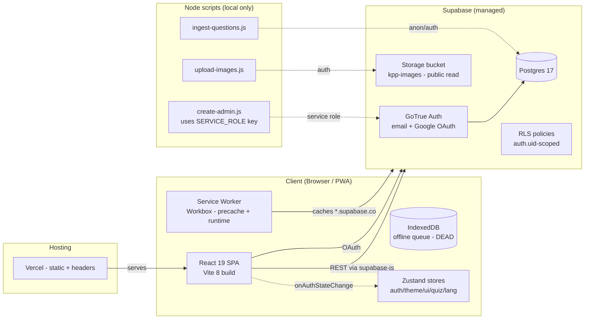

# DriveMy — End-to-End Technical Audit

> **Audit scope:** `SD032_DriveMy` — Bilingual (EN/BM) PWA for Malaysian learner drivers (JPJ KPP1 theory + practical driving test prep).
> **Audit date:** 2026-07-03
> **Auditor:** Principal SRE / Security Architect (no-blindspot audit)
> **Method:** Static review of source, config, schema, lockfile; `npm audit`; evidence cited as `file:line`. No runtime pentest performed.
> **Honesty note:** Items are marked **CRITICAL** when missing/exploitable, **N/A — verified not applicable** when truly out of scope. Nothing is assumed.

---

## 1. Executive Summary

**Overall risk score: 6.5 / 10 (Elevated)** — a competent, well-structured client-side PWA with strong RLS foundations, undermined by a plaintext service-role key on disk, zero CI/test/observability, weak auth posture, and several high-impact dead-code/performance defects.

DriveMy is a **client-only React 19 + Vite 8 SPA** backed by **Supabase** (Postgres + Auth + Storage). There is no custom backend server — all data access goes from the browser to Supabase's auto-generated REST API, protected (correctly) by Row-Level Security. The schema is clean, RLS is enabled on every user-data table, and policies are properly `auth.uid()`-scoped. That is the good news, and it is genuinely good.

The bad news: the **Supabase service-role key sits in plaintext in `.env.local`** (a key that bypasses all RLS), admin accounts are created with the hardcoded password `password123`, email verification is disabled, the production build ships **full sourcemaps** and **caches Supabase API responses (including authed ones, with status `0`) in the service worker**, there is **no CI, no tests, no error tracking, no rate limiting**, and the offline-sync feature is fully implemented but **never wired up** (and would hit a table-name bug if it were).

### Top 5 critical gaps

1. **Plaintext Supabase service-role key in `.env.local`** (`scripts/create-admin.js:27`, `.env.local:3`). Bypasses all RLS. Not in the client bundle (verified), but one `VITE_` prefix or file-rename away from a catastrophic leak. Must be rotated and removed from disk.
2. **Hardcoded admin credentials `admin@drivemy.com` / `password123`** (`scripts/create-admin.js:37-38`) — created with `email_confirm: true`. Trivially guessable full-account-access credential.
3. **Zero CI/CD, zero automated tests, zero error tracking** — no `.github/`, no test files, no Sentry/Datadog, `ErrorBoundary` only `console.error`s. Deploys are manual `npm build` → Vercel with no gates, no rollback, no smoke tests.
4. **Production sourcemaps + SW caching of authed Supabase responses** (`vite.config.ts:201` `sourcemap:true`; `vite.config.ts:139-153` caches `*.supabase.co` with `statuses:[0,200]`). Source leakage + cross-user stale-data risk on shared devices.
5. **Weak auth posture**: email verification disabled (`supabase/config.toml:221`), 6-char minimum password with no complexity (`:177-180`), no MFA, no session timeout, no captcha, `site_url`/`additional_redirect_urls` still point at `127.0.0.1:3000` (`:154,158`).

---

## 2. Architecture Overview

### Current state

**Key properties:**
- **No application server.** The browser talks directly to Supabase REST. All authorization is RLS-based (this is the correct pattern for Supabase and is implemented correctly).
- **PWA** via `vite-plugin-pwa` (Workbox) — precaches all build assets, runtime-caches Google Fonts, images, and Supabase API calls.
- **State:** Zustand (5 stores) for client state; TanStack Query for server cache; Supabase manages the session (supabase-js storage).
- **Heavy vendor chunks** isolated: Phaser (driving simulations), jspdf/html2canvas (PDF reports), recharts (progress charts).
- **Bilingual** EN/BM via a custom translations module (`src/lib/translations/`).

### Boundary of the audit
- ✅ Source code in `src/`, `supabase/`, `scripts/`, root configs.
- ✅ `npm audit` against `package-lock.json`.
- ❌ No runtime/DAST scan, no Supabase dashboard inspection (config inferred from `config.toml` + `setup_schema.sql`), no Lighthouse run against a live deploy.

---

## 3. Detailed Findings by Category

### Dimension 4 — Authentication & Permissions  *(pulled forward: highest impact)*

| # | Finding | Severity | Priority |
|---|---|---|---|
| 4.1 | Email verification disabled | High | P0 |
| 4.2 | Weak password policy (6 chars, no complexity) | High | P0 |
| 4.3 | No MFA; no session timebox/inactivity timeout | Medium | P2 |
| 4.4 | `site_url` / `additional_redirect_urls` point at localhost | High | P0 |
| 4.5 | Hardcoded admin `password123` | Critical | P0 |
| 4.6 | No captcha on auth; rate limits are Supabase defaults only | Medium | P2 |
| 4.7 | Dual auth state (Zustand `authStore` + TanStack `useAuth`) — race | High | P1 |
| 4.8 | `/auth/callback` is a blind `Navigate`, no error handling | Low | P2 |

**4.1 Email verification disabled — `supabase/config.toml:221` `enable_confirmations = false`.**
*Current risk:* Any email address can sign up and immediately access authenticated data — including scraping the entire `kpp_questions` pool via the REST API. No proof of email ownership is required. Combined with open signup (`enable_signup = true`, `:171`), this enables mass fake-account creation.
*Fix:* Set `[auth.email] enable_confirmations = true`. Verify the existing `VerifyEmailPage.tsx` flow handles the post-signup confirmation state correctly.

**4.2 Weak password policy — `config.toml:177-180`: `minimum_password_length = 6`, `password_requirements = ""` (empty = no complexity rules).**
*Current risk:* Six-character passwords with no mixed-case/digit/symbol requirement are brute-forceable in seconds. `create-admin.js:38` proves the pattern is culturally accepted (`password123`).
*Fix:* `minimum_password_length = 10`, `password_requirements = "lower_upper_letters_digits_symbols"`. Enforce the same client-side in `AuthPage.tsx` via the existing `zod` dependency.

**4.3 No MFA, no session timeout — `config.toml:266-271` (sessions section commented out), `:297-304` MFA TOTP disabled.**
*Current risk:* A stolen session token (e.g., from the SW cache issue in §7.1, or a shared device) grants indefinite access. No idle timeout forces re-auth.
*Fix:* Enable `[auth.sessions] inactivity_timeout = "8h"` (Pro-tier feature for MFA; sessions config is available). At minimum set `jwt_expiry` deliberately (currently 3600s — acceptable) and document refresh-token rotation (already enabled, `:166`).

**4.4 Localhost redirect URLs in production config — `config.toml:154,158`.**
*Current risk:* `site_url = "http://127.0.0.1:3000"` and `additional_redirect_urls = ["https://127.0.0.1:3000"]`. In production, password-reset and OAuth redirect emails will link to localhost, breaking the flow entirely (or, if an attacker runs a local server, intercepting the redirect). The app code uses `window.location.origin` (`auth.service.ts:18,38`) which is correct, but the Supabase-side allow-list will reject production origins.
*Fix:* Set `site_url` and `additional_redirect_urls` to the production Vercel domain (e.g., `https://drivemy.vercel.app`), plus `http://localhost:5173` for dev. **This is a production-breaking config bug, not just a hardening issue.**

**4.5 Hardcoded admin credentials — `scripts/create-admin.js:37-38`.**
*Current risk:* `email = "admin@drivemy.com"`, `password = "password123"`, created with `email_confirm: true` via the service-role key. This account is a real, loginable, email-verified user in production. It is not marked as admin anywhere in the schema (there is no `role`/`is_admin` column, no `profiles` table) — so "admin" is a misnomer; it is just a regular authenticated user. But it still grants authenticated access to all user-scoped data.
*Fix:* Delete this script. If an admin role is genuinely needed, add an `is_admin` column to a `profiles` table, gate it with an RLS policy `using (auth.uid() = id AND is_admin)`, and create the account interactively with a strong generated password. Never commit credentials.

**4.7 Dual auth state race — `src/stores/authStore.ts` vs `src/hooks/useAuth.ts`.**
*Current risk:* `ProtectedRoute` reads `isAuthenticated` from Zustand `authStore` (hydrated by `AuthInit` via `onAuthStateChange` in `App.tsx:53-77`). `AuthPage` uses TanStack `useSignIn` (`useAuth.ts:20`) which calls `signIn` then *manually* sets the Zustand store — while `onAuthStateChange` *also* fires for the same event. Two writers, potential divergence: on a flaky network the TanStack cache and Zustand store can disagree, causing `ProtectedRoute` to reject a logged-in user (or accept a logged-out one until the next event).
*Fix:* Pick one source of truth. Recommended: drop the TanStack auth hooks, have `AuthPage` call `auth.service.ts` directly, and rely solely on `onAuthStateChange` → `authStore`. Keep TanStack Query for data only.

---

### Dimension 8 — Security & Row-Level Security

| # | Finding | Severity | Priority |
|---|---|---|---|
| 8.1 | Service-role key in plaintext `.env.local` | Critical | P0 |
| 8.2 | Storage bucket upload open to *any* authenticated user (SVG allowed) | High | P1 |
| 8.3 | No CSP; HSTS missing; security headers minimal | High | P1 |
| 8.4 | RLS: solid on data tables, but no `profiles`/admin RBAC exists | Medium | P2 |
| 8.5 | `dompurify` vulnerability (transitive via jspdf) — moderate XSS bypass | Medium | P1 |
| 8.6 | `react-router` open-redirect advisory (moderate) | Medium | P1 |
| 8.7 | `supabase/.temp/` (CLI state incl. project-ref/pooler-url) committed | Low | P2 |
| 8.8 | Scraped copyrighted Ishihara plates bundled in `public/color-plates` | Medium | P2 |

**8.1 Service-role key on disk — `.env.local:3` (`SUPABASE_SERVICE_ROLE_KEY=eyJ...`), consumed at `scripts/create-admin.js:27`.**
*Evidence:* `grep -rn "service_role\|SERVICE_ROLE" src/` → **zero hits**. The key is **not** in the client bundle and **not** in git history (`.env.local` is gitignored at `.gitignore:17`; `git ls-files` confirms untracked). So this is *not* an active leak — but it is a **landmine**: one misplaced `VITE_` prefix, one rename to `.env`, and the key that bypasses **all** RLS ships to every browser. The key's JWT `exp` is `2036` (10-year lifetime).
*Fix:* (1) **Rotate the key** in Supabase dashboard → Settings → API → "Rotate service role key". (2) Remove it from `.env.local` entirely — the client app never needs it; it belongs only in Supabase Edge Functions / CI secrets. (3) Add a CI grep step asserting the built bundle contains no `service_role`. (4) Treat the local `.env.local` as already-compromised since it sat on a developer machine.

**8.2 Storage upload policy too permissive — `scripts/setup-storage.sql:28-32`.**
*Current risk:* The `kpp_images_authenticated_insert` policy allows **any authenticated user** to INSERT into the public-read `kpp-images` bucket. `allowed_mime_types` includes `image/svg+xml` (`setup-storage.sql:13`). SVG can carry `<script>`. Since the bucket is public-read (`:11` `public = true`), any logged-in user can upload an SVG payload and the URL is served to other users — a **stored-XSS vector** (browsers render SVG-served-as-image for `.svg` when navigated directly; `` is safe, but direct navigation / `<object>` / `<iframe>` is not). There is no admin restriction on who can upload.
*Fix:* (1) Restrict INSERT/UPDATE to an admin role: `TO authenticated WITH CHECK (bucket_id = 'kpp-images' AND auth.uid() IN (SELECT id FROM profiles WHERE is_admin))`. (2) Remove `image/svg+xml` from allowed MIME types (the app uses PNG/JPEG/WebP for plates). (3) Consider setting the bucket to **private** and serving reads through signed URLs or a public read policy only.

**8.3 Missing CSP and HSTS — `vercel.json:16-34` and `public/_headers`.**
*Current risk:* Only three headers are set: `X-Frame-Options: DENY`, `X-Content-Type-Options: nosniff`, `Referrer-Policy: strict-origin-when-cross-origin`. There is **no Content-Security-Policy** (the single most effective XSS mitigation) and **no Strict-Transport-Security** (HSTS). The Lighthouse report in-repo (`docs/reports/lighthouse.md`) explicitly flags CSP as missing. With Google Fonts, Supabase, and inline scripts (the theme script in `index.html:45-60`), a CSP must be carefully crafted but is very achievable.
*Fix:* Add to `vercel.json` headers:
- `Content-Security-Policy: default-src 'self'; script-src 'self' 'unsafe-inline' https://*.supabase.co; connect-src 'self' https://*.supabase.co wss://*.supabase.co https://fonts.googleapis.com https://fonts.gstatic.com; style-src 'self' 'unsafe-inline' https://fonts.googleapis.com; font-src 'self' https://fonts.gstatic.com; img-src 'self' data: blob: https://*.supabase.co; frame-ancestors 'none'` (the inline theme script can be hashed with `'sha256-...'` instead of `'unsafe-inline'` for script-src).
- `Strict-Transport-Security: max-age=63072000; includeSubDomains; preload`.
- `Permissions-Policy: camera=(), microphone=(), geolocation=()`.

**8.4 RLS assessment — mostly excellent, one gap.** RLS is `ENABLE`d on all six tables (`setup_schema.sql:36,64,93,127,148,173`). User-data tables use `FOR ALL … USING (auth.uid() = user_id) WITH CHECK (auth.uid() = user_id)` — correctly scoped for both read and write. `kpp_questions` is `FOR SELECT TO authenticated USING (true)` — read-only for all authenticated users (correct for shared content). Grants are limited to `authenticated` (the `anon` role gets nothing — good). ✅ No `USING (true)` write bypasses. ✅ No `TO public` on data tables.
*Gap:* There is **no `profiles` table and no role column**, so there is no server-side concept of "admin" — the storage upload policy (8.2) and any future admin feature have nothing to gate against. Add a `profiles(id uuid PK REFERENCES auth.users, is_admin bool default false, ...)` table with RLS `USING (auth.uid() = id OR (SELECT is_admin FROM profiles WHERE id = auth.uid()))`.

**8.5 / 8.6 Dependency advisories — see Dimension 7 below.**

**8.7 `supabase/.temp/` committed — `git ls-files supabase/` shows `.temp/cli-latest`, `linked-project.json`, `pooler-url`, `project-ref`, etc.**
*Current risk:* These are Supabase CLI local-state files. `project-ref` (`yvkzixbyxonvlicyrhpy`) is already derivable from the anon URL, but `pooler-url` could contain a connection string with credentials if populated, and the files are clutter that cause merge conflicts.
*Fix:* Add `supabase/.temp/` to `.gitignore` and `git rm --cached -r supabase/.temp`.

**8.8 Scraped Ishihara plates — `scripts/fetch-color-plates.ts:35` scrapes `https://www.colorlitelens.com/ishihara-test.html` with Puppeteer and bundles the images into `public/color-plates`.**
*Current risk:* The Ishihara test plates are copyrighted/clinically standardized material. Scraping and redistributing them (in a public PWA) is a likely copyright/license violation regardless of the source site's own terms — a compliance and IP liability for an educational product.
*Fix:* Replace with properly licensed or public-domain color-vision test plates, or remove the ColorVision feature. Document the licensing provenance of any retained images.

---

### Dimension 3 — Database & Storage

| # | Finding | Severity | Priority |
|---|---|---|---|
| 3.1 | Schema applied manually via SQL Editor, not versioned migrations | High | P1 |
| 3.2 | No `updated_at` triggers; no soft-delete; no audit columns | Medium | P2 |
| 3.3 | `kpp_questions` has no FK to a categories/sets table (denormalized) | Low | P3 |
| 3.4 | Storage bucket is public-read + unrestricted upload (see 8.2) | High | P1 |
| 3.5 | No connection pooling config for production pooler | Medium | P2 |

**3.1 No real migration strategy — `supabase/migrations/` contains only `001_add_unique_constraint.sql`; the full schema lives in `setup_schema.sql` ("Run once in Supabase SQL Editor").**
*Current risk:* Schema changes are manual, unreviewed, and non-reproducible across dev/prod. There is no migration history, no `supabase db push` workflow in CI, and `setup_schema.sql` is only idempotent for `CREATE TABLE IF NOT EXISTS` — subsequent `ALTER`s are ad hoc. The Supabase CLI is clearly installed (`supabase/.temp/` exists) but not used for migrations.
*Fix:* Convert `setup_schema.sql` into ordered migration files under `supabase/migrations/` (`0001_init.sql`, `0002_storage.sql`, …), adopt `supabase db push` for deploys, and run migrations in CI (pre-deploy) — see Dimension 7.

**3.2 No audit/update columns.** Tables have `created_at` but no `updated_at`, no soft-delete (`deleted_at`), no `updated_by`. For a results-tracking app this is acceptable (results are append-only), but `theory_progress` (which has `completed`/`completed_at`) has no `updated_at` to track state changes. *Priority P2.*

**3.3 Denormalized category/set.** `kpp_questions.category` and `set_id` are free `text` with no reference table — typos in seed data create phantom categories. *Low; acceptable for a small fixed question pool.*

**3.5 Pooler disabled locally — `config.toml:38-48` `[db.pooler] enabled = false`.** Production Supabase projects use a PgBouncer-based pooler; the local config disabling it is fine for dev, but there is no documentation that production uses the pooler, and the client never connects to Postgres directly (only via REST/GoTrue), so this is low-risk. *Medium only because connection management is unverified for any future server-side functions.*

---

### Dimension 1 — Frontend Foundations

*(Full evidence in the per-finding table below; highlights summarized.)*

| # | Finding | Severity | Priority |
|---|---|---|---|
| 1.1 | `muted-foreground` on `muted` fails WCAG AA contrast in light mode (3.92:1) | High | P0 |
| 1.2 | Production `sourcemap: true` leaks TS source | High | P0 |
| 1.3 | SW caches authed Supabase responses (`statuses:[0,200]`) — cross-user leak | High | P0 |
| 1.4 | Dual auth state race (see 4.7) | High | P1 |
| 1.5 | Quiz timer persists `timeRemainingSeconds` — exploitable pause | Medium | P1 |
| 1.6 | Mobile menu dialog lacks focus trap + Escape | Medium | P1 |
| 1.7 | Single root ErrorBoundary; reset doesn't remount; `console.error` only | Medium | P1 |
| 1.8 | No error tracking / analytics — zero observability | High | P1 |
| 1.9 | `useOfflineSync` never mounted; `enqueueWrite` never called — dead feature | High | P1 |
| 1.10 | No per-route ErrorBoundaries for 12 lazy pages | Medium | P2 |
| 1.11 | Phaser (~1.1MB) loaded eagerly on `/simulations/:id` route entry | Medium | P2 |
| 1.12 | `modulePreload: false` disables resource hints | Medium | P2 |
| 1.13 | Google Fonts render-blocking chain; Material Symbols loaded globally | Medium | P2 |
| 1.14 | `skipWaiting:true` + `clientsClaim:true` — SW takeover mid-session | Medium | P2 |
| 1.15 | Dual icon libraries (phosphor + lucide, lucide used in 2 files) | Medium | P2 |
| 1.16 | `mock_results` table-name mismatch in dead offline queue | Low | P3 |

**1.1 Contrast failure — `src/index.css` light-mode tokens:** `--muted: 239 239 239` (#efefef), `--muted-foreground: 100 100 100` (#646464) → **3.92:1**, below WCAG 2.1 AA's 4.5:1 for normal text. This pair is used pervasively for secondary text/labels. (Dark mode passes at ~5.48:1.) The recent commit `525c4fa` "improve contrast of ethics scores" moved a hardcoded `#f5f5f5` to `bg-muted` but did not fix the underlying token. *Fix:* darken `--muted-foreground` to ~`#4b4b4b`.

**1.2 Sourcemaps in prod — `vite.config.ts:201` `sourcemap: true`.** Generates `.js.map` files served alongside chunks, reconstructable to original TS (exposes Supabase table names, business logic). *Fix:* `sourcemap: 'hidden'` (or `false` + upload to Sentry).

**1.3 SW caching of authed responses — `vite.config.ts:139-153`.** `NetworkFirst` for `*.supabase.co` with `cacheableResponse.statuses: [0, 200]`. Status `0` = opaque responses (should never be cached here). All Supabase responses including authenticated REST are cached up to 24h. On a shared device, User A's cached `quiz_results` SELECT can be served to User B after logout. *Fix:* remove `0` from statuses; cap `maxAgeSeconds` to 300; split auth vs data caches; `caches.delete('supabase-api')` on signOut.

**1.5 Exploitable quiz timer — `src/stores/quizStore.ts` persists `timeRemainingSeconds`.** A user can close the tab mid-mock-test (45-min limit, `constants.ts`) and reopen to resume with the persisted remaining time — effectively pausing a timed exam indefinitely. *Fix:* persist `startedAt` and recompute elapsed on hydration, or don't persist the timer.

**1.7 ErrorBoundary — `src/components/shared/ErrorBoundary.tsx:31-37`.** `componentDidCatch` only `console.error`s; `handleReset` clears state but doesn't remount the subtree, so the same error re-throws. For chunk-load failures (lazy pages), reset does nothing. *Fix:* per-route boundaries; `window.location.reload()` for chunk failures; integrate Sentry in `componentDidCatch`.

**1.8 Zero observability.** `grep` for sentry/datadog/gtag/posthog → none. `analytics.service.ts` is a Supabase data-access layer, not an analytics SDK. Production errors are invisible to the team. *Fix:* `@sentry/react` init in `main.tsx`, capture in ErrorBoundary, `VITE_SENTRY_DSN` (safe to expose).

**1.9 Dead offline-sync — `src/hooks/useOfflineSync.ts` is **never mounted** (grep returns only its definition); `enqueueWrite` is **never called** anywhere.** The entire IndexedDB write-queue (`offlineStorage.ts`) is dead code. If it were wired, it would also break on mock tests because `offlineStorage.ts:11` uses `"mock_results"` while the table is `mock_test_results`. *Fix:* either mount `useOfflineSync()` in `AuthInit` and call `enqueueWrite` in the result-submission flows (and fix the table name), or delete the dead files.

*Positive frontend observations:* skip-link, `aria-live` on spinners/banners, `prefers-reduced-motion` respected, `sr-only` active-page indicator, `<main tabIndex={-1}>` focus management, lazy-loaded routes with manual vendor chunking, PWA manifest with shortcuts/screenshots, theme-flash-prevention inline script.

---

### Dimension 7 — CI/CD & Version Control

| # | Finding | Severity | Priority |
|---|---|---|---|
| 7.1 | No CI/CD pipeline (no `.github/`, no `vercel/` config beyond headers) | High | P1 |
| 7.2 | Zero automated tests (no test files, no vitest/jest/playwright config) | High | P1 |
| 7.3 | No lint/type-check gate in CI; `lint` script exists but not enforced | Medium | P1 |
| 7.4 | No secret scanning (gitleaks/Dependabot/CodeQL) | High | P1 |
| 7.5 | No DB migration step in deploy pipeline | High | P1 |
| 7.6 | `npm audit`: 5 vulns (1 high, 3 moderate, 1 low) — see below | Medium | P1 |
| 7.7 | No husky/lint-staged pre-commit hooks | Low | P2 |
| 7.8 | `package-lock.json` committed ✅; but `skills-lock.json`/`scripts-lock.json` purpose unclear | Low | P3 |

**7.1 No CI.** `ls .github` → no such directory. Deploys are manual: `npm run build` → push to Vercel. No build validation, no preview-environment gating, no automated rollback, no smoke tests. *Fix:* add `.github/workflows/ci.yml` running `npm ci`, `npm run lint`, `npm run type-check`, `npm run build`, `npm audit --audit-level=high`, and (once added) `vitest run`. Add Vercel Preview deployments per PR.

**7.2 No tests.** `find src -name "*.test.*" -o -name "*.spec.*"` → empty. No vitest/jest/playwright config. The RLS policies (the core security control) have **no automated verification** — a future schema change could silently break `auth.uid()` scoping with no test catching it. *Fix:* add `supabase db push` + pgTAP RLS policy tests (`supabase test db`) verifying a user cannot read another user's `quiz_results`. Add Vitest unit tests for `lib/` utils and the offline queue.

**7.4 No secret scanning.** Dependabot/gitleaks/CodeQL not configured. The `.env.local` is untracked (good) but there is no CI guard against a future `VITE_SUPABASE_SERVICE_ROLE_KEY` slipping in. *Fix:* enable GitHub Dependabot + secret scanning; add a CI step `grep -r "service_role\|SERVICE_ROLE" dist/ && exit 1`.

**7.6 `npm audit` results (run 2026-07-03):**
| Package | Severity | Advisory | Fix |
|---|---|---|---|
| `vite` | **High** | `server.fs.deny` bypass on Windows alternate paths (GHSA-fx2h-pf6j-xcff) | dev-only; update Vite |
| `launch-editor` | **High** | NTLMv2 hash disclosure via UNC path on Windows (GHSA-v6wh-96g9-6wx3) | dev-only (transitive via Vite) |
| `dompurify` ≤3.4.10 | Moderate | Multiple XSS sanitization bypasses (IN_PLACE mode, hook pollution, SAFE_FOR_TEMPLATES) | transitive via jspdf/html2canvas; update chain |
| `react-router` 6.7.0–6.30.3 | Moderate | Open redirect via `//` protocol-relative URL (GHSA-2j2x-hqr9-3h42) | update react-router-dom |
| (1 low) | Low | — | — |

*Note:* the two `high` advisories are dev-tooling-only (Vite dev server / launch-editor) and do not ship in the production bundle. `dompurify` and `react-router` **do** ship to users. `dompurify` is reached via `jspdf`'s HTML→PDF path (`vite.config.ts:212-221` lists `dompurify` in the PDF chunk) — if any user-controlled HTML is rendered into a PDF, the sanitization bypass is exploitable. *Fix:* `npm audit fix` (updates patch versions), then verify `jspdf`/`html2canvas` still render correctly. Pin with `overrides` if upstream is slow.

---

### Dimensions 5, 6 — Hosting, Deployment, Cloud & Compute

DriveMy is a **static SPA on Vercel** + **managed Supabase**. Most of these dimensions are N/A or Supabase-managed.

- **5.1 Hosting platform:** Vercel (static). `vercel.json` present. ✅
- **5.2 Containerization:** **N/A — verified not applicable.** Static SPA, no server process to containerize.
- **5.3 Orchestration (K8s/ECS):** **N/A — verified not applicable.**
- **5.4 Serverless:** Supabase Edge Functions runtime is enabled in `config.toml:369-378` but **no Edge Functions are defined** in the repo — server-side logic (admin creation, any privileged op) is done via local Node scripts instead. This is a gap (see 8.1/4.5) — privileged operations should be Edge Functions, not local scripts with the service-role key.
- **5.5 Environment parity:** ❌ Poor. `config.toml` is a local-dev config (`site_url=http://127.0.0.1:3000`) committed as the single source of truth; there is no documented prod config. **High, P0** (see 4.4).
- **5.6 Domain/DNS:** Not visible in repo. *Cannot verify — requires dashboard access.*
- **5.7 SSL/TLS:** Vercel provides auto-renewing TLS. HSTS missing (see 8.3). **Medium, P1.**
- **5.8 Blue/green / canary:** ❌ None. Vercel supports immutable deploys + instant rollback but no canary/feature-flags are configured. **Medium, P2.**
- **5.9 Feature flags:** ❌ None (no LaunchDarkly/Unleash). **Low, P3.**
- **5.10 IaC:** ❌ No Terraform/Pulumi. Supabase config is a TOML file; Vercel config is JSON. Acceptable for the project's scale. **Low, P3.**
- **6.1–6.7 Compute/IAM/VPC:** **N/A — verified not applicable.** No self-managed compute; Supabase is managed. Cost monitoring is Supabase/Vercel-side.

---

### Dimension 9 — Rate Limiting

| # | Finding | Severity | Priority |
|---|---|---|---|
| 9.1 | No client-side or edge rate limiting on data API | Medium | P2 |
| 9.2 | Auth rate limits are Supabase defaults only (`sign_in_sign_ups=30/5min`) | Medium | P2 |
| 9.3 | No cost-based limiting on expensive ops (PDF gen, quiz fetch) | Low | P3 |

**9.1 No API rate limiting.** Because the client calls Supabase REST directly, the only throttle is Supabase's platform-level limits (defaults in `config.toml:192-206`: `sign_in_sign_ups=30/5min`, `token_verifications=30/5min`). There is **no per-user limit on data reads/writes** — an authenticated user can hammer `kpp_questions` SELECT (capped at `max_rows=1000` per request, `config.toml:18`) or flood-insert `quiz_results`. RLS allows the insert (user-scoped) but nothing prevents volume abuse. *Fix:* add Supabase Edge Function middleware with a per-user token bucket (Redis/Upstash), or accept platform defaults and monitor. At minimum, enable captcha on auth (`config.toml:208-212`) to slow credential stuffing.

---

### Dimension 10 — Caching & CDN

| # | Finding | Severity | Priority |
|---|---|---|---|
| 10.1 | SW caches authed Supabase responses unsafely (see 1.3) | High | P0 |
| 10.2 | `/assets/*` immutable caching ✅ (`vercel.json:5-9`) | — | — |
| 10.3 | Google Fonts caching ✅ (`vite.config.ts:111-137`) | — | — |
| 10.4 | No server-side cache (N/A — no server) | N/A | — |
| 10.5 | No cache invalidation on deploy beyond `skipWaiting` | Medium | P2 |

**10.2/10.3 Positive.** Vercel `cache-control: public, max-age=31536000, immutable` on hashed assets is correct. Workbox fonts caching (CacheFirst for gstatic, StaleWhileRevalidate for googleapis) is textbook-correct. The **only** caching defect is 1.3/10.1 (the Supabase API cache).

---

### Dimension 11 — Load Balancing & Scaling

**N/A — verified not applicable** for a static SPA on Vercel (CDN-edge served) + managed Supabase (auto-scaled by Supabase). No LB, no auto-scaling groups, no graceful shutdown logic to write. The only scaling concern is Supabase plan limits (connection pooler, DB size) — managed by the platform. *No findings.*

---

### Dimension 12 — Error Tracking & Logs

| # | Finding | Severity | Priority |
|---|---|---|---|
| 12.1 | No error tracking (Sentry/Rollbar) — errors only `console.error` | High | P1 |
| 12.2 | No centralized/structured logging | Medium | P2 |
| 12.3 | No PII redaction policy (N/A — no logging at all, but plan for it) | Low | P3 |

**12.1** — see 1.8. `ErrorBoundary.componentDidCatch` (`ErrorBoundary.tsx:31`) does `console.error` only. In a production PWA used by learner drivers (possibly offline), crashes are silent. *Fix:* Sentry React SDK, `Sentry.init` in `main.tsx`, capture in boundary, release tracking via `VITE_SENTRY_DSN`. **P1.**

---

### Dimension 13 — Availability & Recovery

| # | Finding | Severity | Priority |
|---|---|---|---|
| 13.1 | No SLO/SLA defined | Low | P3 |
| 13.2 | DR plan = Supabase-managed backups (unverified) | Medium | P2 |
| 13.3 | No runbook / on-call | Low | P3 |
| 13.4 | Multi-region: N/A (Vercel CDN + Supabase single-region) | N/A | — |

**13.2** Supabase provides automated daily backups on Pro plans. **Not verified** whether the project is on Pro or Free (Free has no PITR). The repo contains no backup-restore documentation or fire-drill record. *Fix:* confirm Supabase plan, document RTO/RPO (Supabase PITR is ~5min RPO on Pro), and record a restore runbook. **Medium, P2.**

---

### Dimension 14 — Compliance & Governance

| # | Finding | Severity | Priority |
|---|---|---|---|
| 14.1 | No Privacy Policy / ToS / cookie consent in-app | Medium | P2 |
| 14.2 | PII: email + quiz/sim results stored; no data-export/delete (GDPR/CCPA) flow | Medium | P2 |
| 14.3 | Scraped copyrighted Ishihara plates (see 8.8) | Medium | P2 |
| 14.4 | No audit log of admin actions (no admin system exists yet) | Low | P3 |

**14.2** The schema stores `user_id`-linked quiz/mock/simulation/colorblind results (behavioral data) and auth emails. There is **no user-facing data-export or account-deletion flow** — a GDPR/CCPA right-to-erasure requirement. Account deletion would cascade (FKs are `ON DELETE CASCADE`, `setup_schema.sql:49,78,107,141,162`) so the data layer supports it, but no UI/edge-function exposes it. *Fix:* add a "Delete my account" action calling a Supabase Edge Function that deletes the `auth.users` row (cascades) after reauth. **Medium, P2.**

---

### Dimension 15 — Observability & Testing in Production

| # | Finding | Severity | Priority |
|---|---|---|---|
| 15.1 | No synthetic monitoring / uptime checks | Medium | P2 |
| 15.2 | No RUM | Medium | P2 |
| 15.3 | No load testing | Low | P3 |
| 15.4 | Lighthouse report exists in-repo (`docs/reports/lighthouse.md`) but not wired to CI | Low | P3 |

**15.4** The repo contains a Lighthouse report (referenced by the deps agent), indicating Lighthouse has been run manually. It is not in CI (no Lighthouse CI action). The report itself flags CSP and TTFB. *Fix:* add Lighthouse CI to GitHub Actions on PRs. **Low, P3.**

---

### Dimension 2 — APIs & Backend Logic

There is **no custom backend** — all "backend logic" is Supabase auto-generated REST + the client service layer in `src/services/`.

| # | Finding | Severity | Priority |
|---|---|---|---|
| 2.1 | No request validation layer (zod present but unused for API I/O) | Medium | P2 |
| 2.2 | Client-side `insert` of results bypasses server validation (relies on RLS CHECK) | Medium | P2 |
| 2.3 | No API versioning (Supabase REST v1 only) | Low | P3 |
| 2.4 | No webhook / async job processing | N/A | — |
| 2.5 | File upload: MIME/size limited ✅, but upload policy open (see 8.2) | High | P1 |
| 2.6 | No OpenAPI/Postman docs for the data model | Low | P3 |

**2.1/2.2** `zod` is a dependency (`package.json:62`) but is only used for form validation, not for validating Supabase payloads. Results are inserted client-side (`useOfflineSync.ts:20`, the service layer) with the full payload — the only server-side guard is the RLS `WITH CHECK (auth.uid() = user_id)` and column CHECK constraints. A client could submit a `quiz_results` row with an inflated `score`/`percentage` (the app computes it, but nothing server-side recomputes/verifies it against `answers`). *Current risk:* a user can write any `percentage` they want to their own results — self-harm only, but it defeats progress analytics. *Fix:* add a Supabase Edge Function or DB trigger that recomputes `score`/`percentage` from `answers` + `question_ids` on INSERT, rejecting mismatches. **Medium, P2.**

---

## 4. Blind Spot Analysis — what's completely missing that most teams forget

1. **RLS policy tests.** Everyone enables RLS; almost no one *tests* that the policies actually deny cross-user access. A single `supabase test db` (pgTAP) suite asserting "user A cannot SELECT user B's quiz_results" would catch regressions. **Completely absent here.**
2. **Service-role key hygiene.** The key is correctly kept out of the client bundle, but its mere presence in a plaintext dev `.env.local` for years (`exp: 2036`) is the classic Supabase footgun. The mitigation is process (rotate + remove + CI grep), not code.
3. **The offline feature that doesn't exist.** `useOfflineSync` + `offlineStorage` + `enqueueWrite` are fully implemented and *zero-percent wired up*. This is the most dangerous kind of dead code: it reads like a working feature, so no one notices the offline writes are silently dropped (and the table name is wrong). Either ship it or delete it.
4. **Server-side score verification.** Trusting the client's `percentage` is the kind of oversight that only matters when someone cares enough to cheat their own dashboard — but for an exam-prep product with a "readiness" score, it undermines the product's signal.
5. **CSP.** The single most effective XSS control, and it is absent — despite the app having a clear stored-XSS vector (SVG uploads to a public bucket, §8.2) and a vulnerable `dompurify` in the PDF chain (§8.5).
6. **Post-deploy verification.** No smoke test, no `npm run preview` check in CI, no synthetic ping. A broken deploy is discovered by a user.
7. **Redirect-URL allow-list for production.** `config.toml` still names `127.0.0.1:3000`. This will break password-reset and Google-OAuth in production — the kind of bug that only surfaces after deploy, in front of users.
8. **`profiles` table / RBAC foundation.** There is no place to put an `is_admin` flag, so every future admin feature will bolt on an insecure pattern (like the current storage upload policy, §8.2).

---

## 5. Remediation Roadmap

### 30-day plan (P0 — stop the bleeding)
1. **Rotate the Supabase service-role key** and remove it from `.env.local`. It lives only in CI secrets / Edge Function env. (§8.1)
2. **Delete `scripts/create-admin.js`** and any `admin@drivemy.com` / `password123` account in production. (§4.5)
3. **Fix production auth config:** `site_url` + `additional_redirect_urls` → real Vercel domain; `enable_confirmations = true`; `minimum_password_length = 10` + complexity. (§4.1, 4.2, 4.4)
4. **Production sourcemaps off:** `sourcemap: 'hidden'`. (§1.2)
5. **Fix SW Supabase cache:** remove status `0`, cap TTL to 300s, clear cache on signOut. (§1.3/10.1)
6. **Add CSP + HSTS** to `vercel.json` / `public/_headers`. (§8.3)
7. **Lock down storage upload** to an admin role (or remove SVG from allowed MIME types immediately). (§8.2)
8. **Fix light-mode contrast** (`--muted-foreground` token). (§1.1)

### 60-day plan (P1 — close the gaps)
9. **Add CI:** GitHub Actions — `npm ci`, lint, type-check, build, `npm audit --audit-level=high`, RLS policy tests. (§7.1, 7.3, 7.4)
10. **Add tests:** pgTAP RLS policy tests (highest value) + Vitest unit tests for `lib/`. (§7.2)
11. **Integrate Sentry** for error tracking; capture in ErrorBoundary. (§1.7, 1.8, 12.1)
12. **Resolve dual auth state** — single source of truth via `onAuthStateChange` → `authStore`. (§4.7)
13. **Add per-route ErrorBoundaries**; chunk-load retry fallback. (§1.7, 1.10)
14. **Fix quiz-timer persistence** (store `startedAt`, recompute). (§1.5)
15. **Fix mobile-menu focus trap** (use Radix Dialog). (§1.6)
16. **`npm audit fix`** for `dompurify`/`react-router`; verify PDF render + routing. (§8.5, 8.6)
17. **Wire up or delete offline-sync** (and fix the `mock_results` table name). (§1.9, 1.16)
18. **Add `profiles` table with `is_admin`** + RLS, as the foundation for RBAC. (§8.4)
19. **Convert `setup_schema.sql` → ordered migrations** + `supabase db push` in CI. (§3.1, 7.5)
20. **Server-side score recomputation** (Edge Function or trigger). (§2.2)

### 90-day plan (P2/P3 — hardening & polish)
21. Per-route code-splitting refinements: dynamic Phaser import, `motion` chunk, self-host fonts, drop `lucide-react`, re-enable `modulePreload`. (§1.11–1.15)
22. `skipWaiting: false` for safer SW updates. (§1.14)
23. MFA for admin accounts; session inactivity timeout. (§4.3)
24. Rate limiting via Edge Function + Upstash; captcha on auth. (§9.1, 9.2)
25. GDPR data-export/delete flow. (§14.2)
26. Privacy Policy + cookie consent (if any analytics added). (§14.1)
27. Replace scraped Ishihara plates with licensed content. (§8.8, 14.3)
28. Lighthouse CI + synthetic uptime monitoring. (§15.1, 15.4)
29. Document Supabase plan / backup RPO; restore runbook. (§13.2)
30. `git rm --cached supabase/.temp` + gitignore it. (§8.7)

---

## 6. Appendix

### A. Tooling references
- **SAST/SCA:** GitHub Dependabot, `npm audit`, CodeQL, Snyk (pick one).
- **RLS testing:** `supabase test db` (pgTAP) — `https://supabase.com/docs/guides/database/testing`.
- **Error tracking:** `@sentry/react` — `https://docs.sentry.io/platforms/javascript/guides/react/`.
- **CSP:** use a header generator + the inline theme-script SHA-256 (compute from `index.html:45-60`).
- **Edge Functions:** `https://supabase.com/docs/guides/functions` — for score verification, admin ops, rate limiting.

### B. Compliance mapping
| Control area | Status | Note |
|---|---|---|
| OWASP A03 (Injection) | ✅ Low risk | Parameterized via Supabase REST; no raw SQL client-side. |
| OWASP A07 (Auth) | ❌ Weak | Email verification off, weak passwords, no MFA (§4.1–4.3). |
| OWASP A01 (Access Control) | ✅ Strong RLS | But untested (§7.2) and storage upload open (§8.2). |
| OWASP A05 (Security Misconfig) | ❌ | No CSP/HSTS, sourcemaps, localhost redirect config (§8.3, 1.2, 4.4). |
| OWASP A06 (Vuln Components) | ⚠️ | 4 ship-to-user advisories (§7.6). |
| OWASP A09 (Logging/Monitoring) | ❌ | Zero observability (§12.1). |
| GDPR/CCPA | ⚠️ | No export/delete flow (§14.2). |

### C. Severity / priority legend
- **Critical:** exploitable now or one-step-from-catastrophic (service key on disk, `password123` admin).
- **High:** real security/correctness defect with a concrete failure scenario.
- **Medium:** hardening or likely-broken-in-prod issue.
- **Low:** polish, consistency, minor tech debt.
- **P0** 30-day / **P1** 60-day / **P2** 90-day / **P3** backlog.

### D. Files inspected (selection)
`package.json`, `vite.config.ts`, `vercel.json`, `.env.local`, `.gitignore`, `index.html`, `eslint.config.js`, `tailwind.config.js`, `src/App.tsx`, `src/main.tsx`, `src/lib/supabase.ts`, `src/lib/offlineStorage.ts`, `src/hooks/useAuth.ts`, `src/hooks/useOfflineSync.ts`, `src/stores/authStore.ts`, `src/services/auth.service.ts`, `src/components/shared/{ErrorBoundary,ProtectedRoute,AppLayout}.tsx`, `src/components/shared/AuthLayout.tsx`, `src/pages/auth/AuthPage.tsx`, `supabase/config.toml`, `supabase/setup_schema.sql`, `supabase/migrations/001_add_unique_constraint.sql`, `scripts/setup-storage.sql`, `scripts/create-admin.js`, `scripts/fetch-color-plates.ts`, `public/_headers`, `public/_redirects`. `npm audit` executed 2026-07-03.
